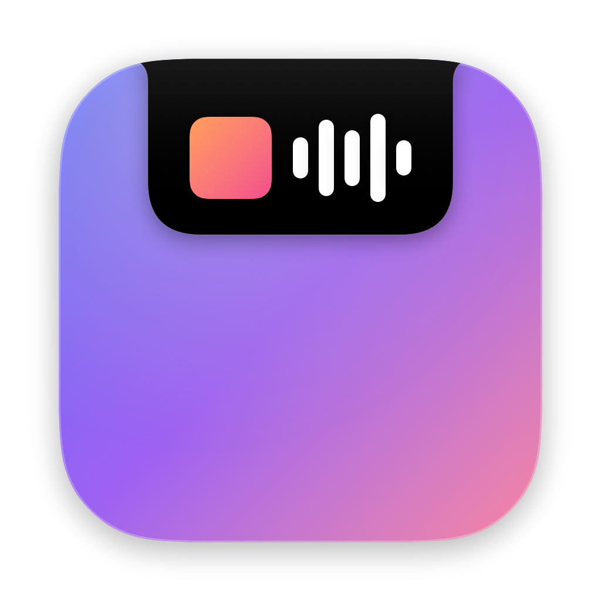
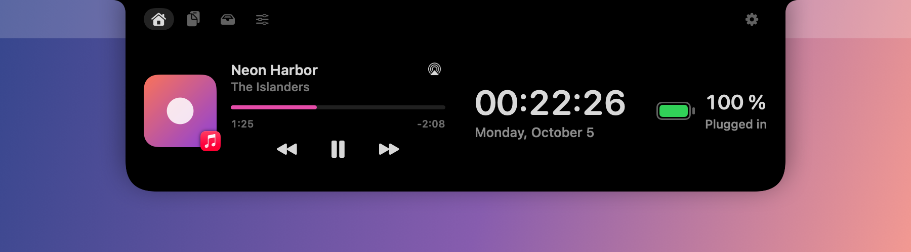
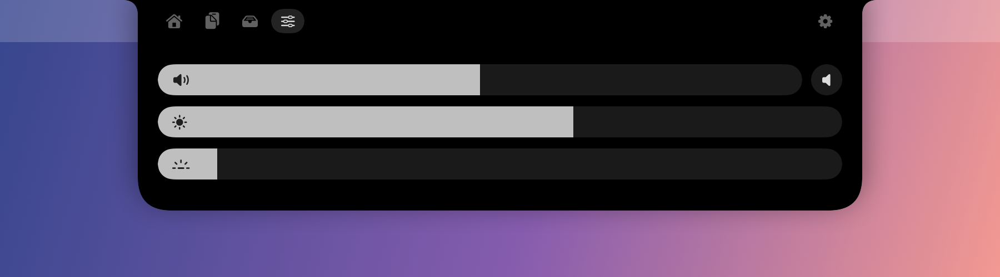
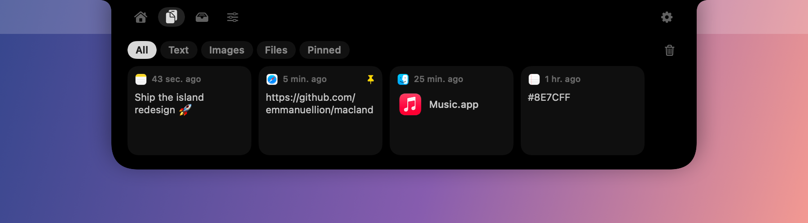
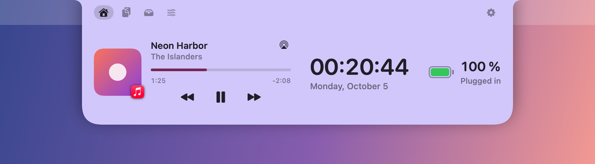
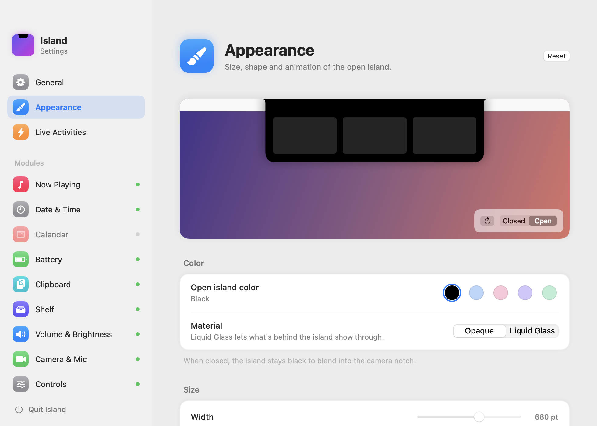
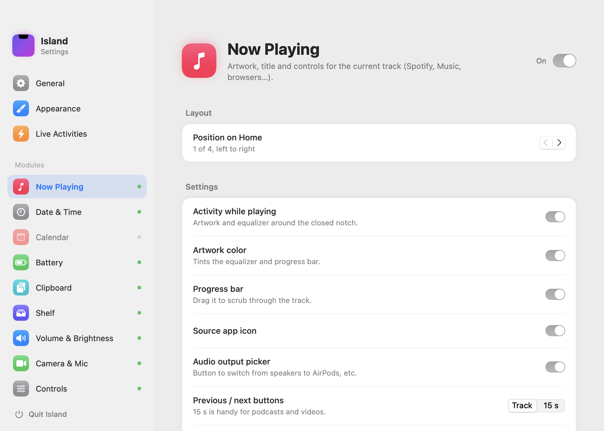

<p align="center">
  
</p>

<h1 align="center">Island</h1>

<p align="center">
  Turn the MacBook notch into a living, fully configurable island.<br>
  Free, open source, no telemetry, everything stays on your Mac.
</p>

<p align="center">
  
</p>

> 🇫🇷 Island est aussi disponible en français : l'app suit la langue de macOS, ou se règle dans Réglages › Général › Langue.

## Features

| | |
|---|---|
| **Now Playing** | Artwork, title, controls, a draggable progress bar and an audio output picker. Works with Spotify, Music, browsers… |
| **Clipboard** | Text, image and file history with filters and pinning. Opens from anywhere with ⌃⌘V. |
| **Shelf** | Drop files on the notch to keep them at hand, AirDrop them, zip them or convert images. |
| **Controls** | Volume, display brightness and keyboard backlight sliders, right in the island. |
| **Volume & Brightness HUD** | Replaces the macOS volume and brightness overlays with a gauge under the notch. |
| **Camera & Mic** | Green and orange dots next to the notch while they're in use, with the name of the app using the mic. |
| **Live Activities** | Short updates around the closed notch: charging, low battery, upcoming events, music. |
| **Date & Time, Battery, Calendar** | At-a-glance widgets on the home page. |

Every module can be turned on or off, reordered and tuned. The island itself comes in black, four pastel colors or **Liquid Glass** (macOS 26+) with adjustable tint.

<p align="center">
  
  
  
  
</p>

<p align="center">
  
</p>

<p align="center">
  
  
</p>

## Install

1. Download `Island-x.y.z.dmg` from the [Releases](../../releases) page and drag **Island** to **Applications**.
2. Open it. Island isn't notarized by Apple (it's a free side project without a paid developer account), so macOS will block it the first time:
   open **System Settings › Privacy & Security**, scroll down and click **Open Anyway**.
3. Hover the notch. Settings are in the menu bar icon, or right-click the island.

Optional permissions:
- **Accessibility** – to replace the system volume/brightness HUD and to auto-paste from the clipboard.
- **Calendars** – for the Calendar widget (off by default).

Requires macOS 15 or later on a Mac with a notch (other displays can show a virtual island).

## Build from source

No Xcode or Apple developer account needed — the Command Line Tools are enough.

```sh
scripts/build-app.sh --run            # builds build/Island.app and launches it
scripts/build-app.sh --install --run  # installs to ~/Applications (needed for launch at login)
scripts/make-dmg.sh                   # builds build/Island-<version>.dmg
```

The build script signs with a local self-signed certificate named “Island Local Signing” if one exists in your keychain
(so macOS keeps granted permissions between builds), and falls back to ad-hoc signing otherwise.

## How it works

- Now Playing uses [mediaremote-adapter](https://github.com/ungive/mediaremote-adapter) (BSD-3, vendored in `Vendor/`):
  since macOS 15.4 only Apple-signed binaries may read MediaRemote, so the adapter runs inside `/usr/bin/perl`.
- Brightness and keyboard backlight use the private DisplayServices and CoreBrightness frameworks.
- Camera/mic detection uses CoreMediaIO and per-process CoreAudio properties — no camera or microphone access is requested.

Private APIs mean an Apple update can break a feature; Island degrades gracefully when that happens.

## License

[MIT](LICENSE). The vendored mediaremote-adapter keeps its own BSD 3-Clause license.
