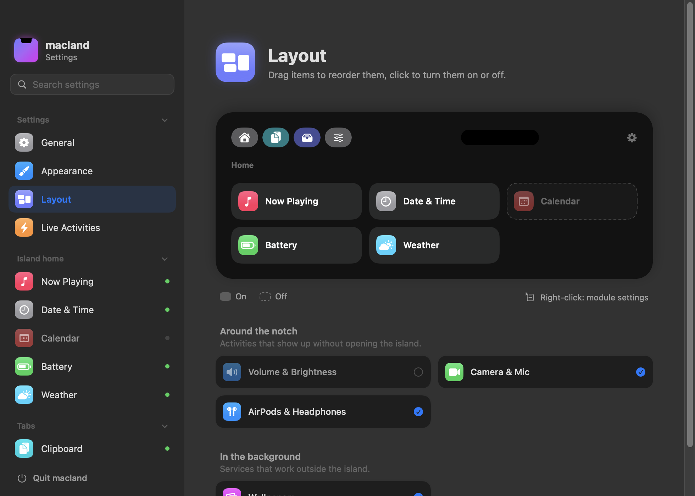
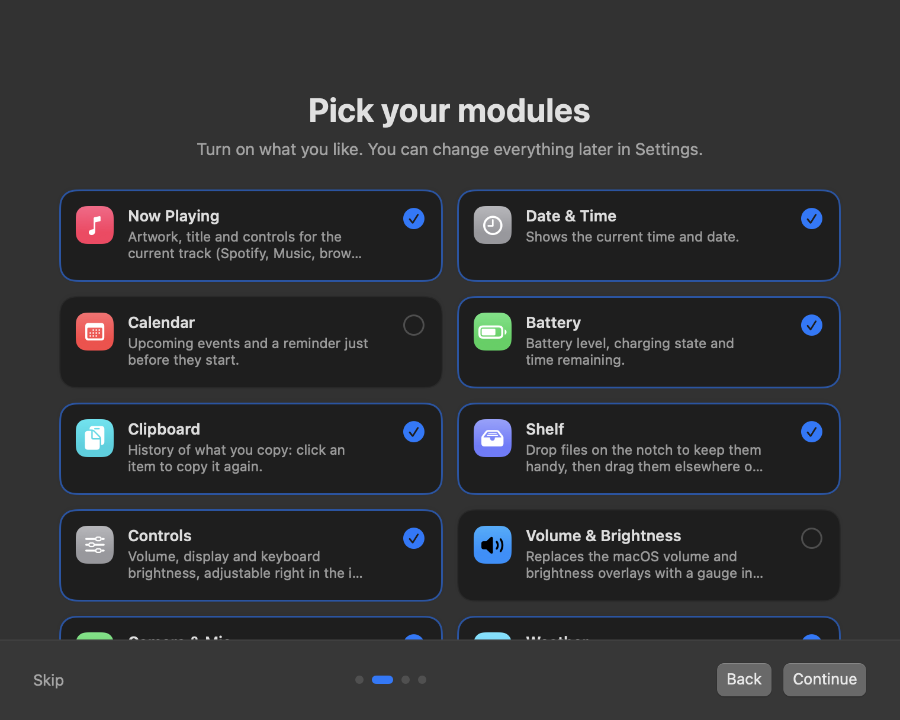

<p align="center">
  
</p>

<h1 align="center">macland</h1>

<p align="center">
  Turn the MacBook notch into a living, fully configurable island.<br>
  Free, open source, no telemetry. Everything stays on your Mac, except the optional weather lookup.
</p>

<p align="center">
  
</p>

> 🇫🇷 macland est aussi disponible en français : l'app suit la langue de macOS, ou se règle dans Réglages › Général › Langue.

## Features

### In the island

| | |
|---|---|
| **Now Playing** | Artwork, title, controls, a draggable progress bar and an audio output picker. Works with Spotify, Music, browsers… |
| **Date & Time, Battery, Weather, Calendar** | At-a-glance home widgets that adapt their size when space runs out. Battery can also sit as a small indicator in the corner. |
| **Clipboard** | Text, image and file history with filters and pinning. Opens from anywhere with ⌃⌘V. |
| **Shelf** | Drop files on the notch to keep them at hand, AirDrop them, zip them or convert images. |
| **Controls** | Volume, display brightness and keyboard backlight sliders. |

### Around the notch

| | |
|---|---|
| **Volume & Brightness HUD** | Replaces the macOS volume and brightness overlays with a gauge under the notch — including keyboard backlight. |
| **Camera & Mic** | Green and orange dots while they're in use, with the name of the app using the mic. |
| **AirPods & Headphones** | Announces Bluetooth headphones when they connect, with left / right / case battery. |
| **Live Activities** | Short updates around the closed notch: charging, low battery, upcoming events, music. |

### Video wallpapers

Play your own videos on the desktop, alone or as **playlists** that rotate at the interval you choose, with crossfades.
On macOS 26+, the **lock screen** gets the same video, animated, natively — macland registers it with macOS for you, nothing to set up.
Playback pauses on its own when windows cover the desktop, in full screen, on battery or in Low Power Mode (each one is your call).

<p align="center">
  
  
  
  
</p>

<p align="center">
  
</p>

## Make it yours

- **Every module** can be turned on or off and tuned; home widgets and tabs are arranged by **drag and drop** on the Layout page.
- **Colors**: black, four pastels or **Liquid Glass** (macOS 26+) with adjustable tint, plus an accent color, outline and shadow.
- **Behavior**: hover or click to open, delays, hover area, which tab opens, hide in full screen, external displays…
- **Searchable settings**: type in the sidebar search field and jump straight to any option.
- **French and English**, light or dark settings window, and a welcome screen that walks you through modules and permissions.

<p align="center">
  
  
</p>

<p align="center">
  
  
</p>

## Install

1. Download `macland-x.y.z.dmg` from the [Releases](../../releases) page and drag **macland** to **Applications**.
2. Open it. macland isn't notarized by Apple (it's a free side project without a paid developer account), so macOS will block it the first time:
   open **System Settings › Privacy & Security**, scroll down and click **Open Anyway**.
3. Follow the welcome screen, then hover the notch. Settings are in the menu bar icon, or right-click the island.

Optional permissions:
- **Accessibility** – to replace the system volume/brightness HUD and to auto-paste from the clipboard.
- **Calendars** – for the Calendar widget (off by default).
- **Location** – only if you choose “Use my location” for the weather.

Requires macOS 15 or later on a Mac with a notch (other displays can show a virtual island). Animated lock screen wallpapers and Liquid Glass need macOS 26 or later.

## Performance

Measured on a MacBook Pro (M5 Pro): about **35 MB** of memory and **~0.2 % CPU** with music playing.
The island's animations run on Core Animation and cost no measurable GPU time.
A video wallpaper does use the GPU while it's visible (the system composites every frame) — that's what the pause options are for.

## Build from source

No Xcode or Apple developer account needed — the Command Line Tools are enough.

```sh
scripts/build-app.sh --run            # builds build/macland.app and launches it
scripts/build-app.sh --install --run  # installs to ~/Applications (needed for launch at login)
scripts/make-dmg.sh                   # builds build/macland-<version>.dmg
```

The build script signs with a local self-signed certificate named “Island Local Signing” if one exists in your keychain
(so macOS keeps granted permissions between builds), and falls back to ad-hoc signing otherwise.

## How it works

- Now Playing uses [mediaremote-adapter](https://github.com/ungive/mediaremote-adapter) (BSD-3, vendored in `Vendor/`):
  since macOS 15.4 only Apple-signed binaries may read MediaRemote, so the adapter runs inside `/usr/bin/perl`.
- Animated lock screen wallpapers are added to the macOS “Aerials” catalog in your user Library and selected for you;
  macOS then plays them itself. Your original wallpaper is backed up and restored when you switch back.
- Brightness and keyboard backlight use the private DisplayServices and CoreBrightness frameworks.
- Camera/mic detection uses CoreMediaIO and per-process CoreAudio properties — no camera or microphone access is requested.
- Weather comes from [Open-Meteo](https://open-meteo.com) (free, no account) and is the only feature that goes online.

Private APIs mean an Apple update can break a feature; macland degrades gracefully when that happens.

## License

[MIT](LICENSE). The vendored mediaremote-adapter keeps its own BSD 3-Clause license.
